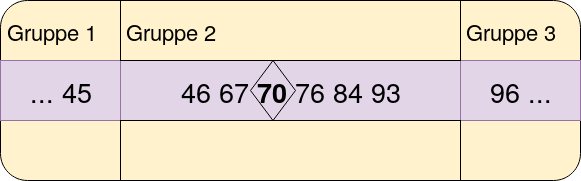

Bei der Aufgabe _Voll Daneben_ setzen Teilnehmer ihren Einsatz von 25$ auf ihre persönliche _Glückszahl_. AlCapone Junior versucht dann, anhand der Glückszahlen der Teilnehmer 10 Zahlen zu wählen. Für jeden Teilnehmer wird dann die Differenz zwischen seiner Glückszahl und der am nächsten liegenden AlCapone-Zahl ausgezahlt. Ziel ist es, einen Algorithmus zu schreiben, der AlCapone's Zahlen so bestimmt, dass AlCapone möglichst einen Gewinn erzielt.

# Lösungsidee

Die Lösungsidee teilt sich in zwei unterschiedliche Vorgehen auf.

1. Berechnen der Zahlen aus dem Durchschnitt gleich großer Abschnitte.
2. Bilden von Gruppen aus den Glückszahlen der Teilnehmer, wobei bei jeder Gruppe ein Gewinn garantiert ist.

Für beide Verfahren sollten die Glückszahlen der Teilnehmer aufsteigend sortiert vorliegen.

## Verfahren 1 - Durchschnitt gleich großer Abschnitte
Zu Beginn wird der gesamte Zahlenbereich[^Zahlenbereich] betrachtet. Dieser wird in zehn gleich große Abschnitte unterteilt. Für jeden Abschnitt wird der Durchschnitt aller Glückszahlen im Abschnitt berechnet. Der Durchschnitt jedes Abschnittes gilt dann als eine von zehn Zahlen für AlCapone. Da es nur zehn Abschnitte gibt, gibt es dann auch nur zehn Zahlen.

[^Zahlenbereich]: Als Zahlenbereich wird der Abstand zwischen kleinster und größter Glückszahl bezeichnet. Der Begriff beschreibt also den Bereich, in dem sich alle Glückszahlen befinden. 

## Verfahren 2 - Capone Zahlen durch Gruppen
Bei diesem Verfahren werden aus allen Glückszahlen Gruppen gebildet. Dabei hat jede Gruppe einen Teil von Glückszahlen, die sie abdeckt. Für jede Gruppe gibt es eine Zahl, die wir hier `capone` nennen. Diese Zahl hat zur ersten und letzen Glückszahl in einer Gruppe je eine Differenz, die kleiner als 25 ist. 

Diese maximale Differenz von unter 25 sorgt dafür, dass AlCapone Jr. für jede Glückszahl eine Auszahlung unter 25 hat. Durch den Einsatz von 25 und die Auszahlung der Differenz zu `capone`, gilt für jede Glückszahl $Einsatz-Differenz=Gewinn$. In jeder Gruppe ist die Differenz zu `capone` jedoch kleiner als der Einsatz. Somit wird ein Gewinn erwirtschaftet. 

{width=50%}

Abbildung 1 ist ein Beispiel für eine Gruppe aus der Menge an Glückszahlen. So hat man in der zweiten Gruppe die Zahlen von 46 bis 93. Die Zahl 70 dient dabei als `capone` Zahl, da sie einen Abstand von unter 25 zur ersten und letzten Zahl der Gruppe hat. Der Abstand zur 45 beziehungsweise 96 ist größer als 25. Daher sind diese beiden Zahlen jeweils in anderen Gruppen.

Wählt man jetzt für jede Gruppe die Zahl `capone` als eine der Zehn AlCapone-Zahlen, so würde man garantiert einen Gewinn erzielen. Sollte es mehr als zehn Gruppen geben, und damit mehr als zehn mögliche Zahlen für AlCapone Jr. vorhanden sein, müssen Gruppen zusammengefügt werden.

### Gruppen zusammenfügen

Bei mehr als zehn Gruppen müssen zwei Gruppen jeweils so lange zusammengefügt werden, bis die Anzahl der Gruppen nur noch zehn beträgt. Bei der Findung des passenden Gruppenpaares muss beachtet werden, dass nur direkt hintereinander liegende Gruppen zusammengefügt werden sollten. Andernfalls würden sich Gruppen überschneiden.

Um ein passendes Gruppenpaar zu finden, wird für jedes mögliche Gruppenpaar der Gewinn für jede Zahl im Gruppenpaar berechnet.[^GewinnMerged] Das Gruppenpaar mit dem höchsten Gesamtgewinn wird zusammengefügt. Da die Wahl der Gruppen auf dem Prinzip des garantierten Gewinnes basiert, möchte man auch bei zusammengefügten Gruppen dieses Prinzip garantieren. 

Meist lässt sich aber bei einer zusammengefügten Gruppe ein Gewinn nicht mehr garantieren, da der Bereich der neuen Gruppe zu groß ist. Also versucht man eine Gruppe zu bilden, bei der die Glückszahlen innerhalb der neuen Gruppe einen möglichst geringen Abstand zu der `capone` Zahl der neuen Gruppe haben. Anzumerken ist hierbei, dass die `capone` Zahl nicht mehr berechnet wird, sondern den Median aller Glückszahlen der Teilnehmer in der neuen Gruppe darstellt.

[^GewinnMerged]: Der Gewinn für jede Glückszahl wird dabei anhand der Differenz zwischen der Glückszahl und `capone` der neuen Gruppe berechnet.

## Wahl des passenden Verfahrens
Grundsätzlich werden bei der Lösung der Aufgabe beide Verfahren durchgeführt und das gewinnbringenste Verfahren wird dann angewendet. Dennoch lässt sich abschätzen, wann welches Verfahren am effektivsten ist:

Bei gleichmäßiger Verteilung der Glückszahlen über den Zahlenbereich sollte das erste Verfahren (Durchschnitt gleich großer Abschnitte) gewählt werden. Durch die gleichmäßige Verteilung der zehn Zahlen für AlCapone Jr. wird der gesamte Bereich an Glückszahlen ebenfalls gleichmäßig abgedeckt.

Bei ungleichmäßiger Verteilung der Glückszahlen ist das zweite Verfahren (Gruppen bilden) effektiver. Bei diesem Verfahren werden auch nur Gruppen für Zahlen gebildet, die tatsächlich vorhanden sind. Im Gegensatz dazu werden beim ersten Verfahren die Capone-Zahlen unabhängig von der Anzahl an Glückszahlen in einem Bereich gebildet. Häufig ist es aber bei ungleichmäßiger Verteilung gewinnbringender, wenn man versucht, für viele nah beieinander liegende Glückszahlen einen Gewinn zu erwirtschaften, und dafür einzelne Zahlen zu vernachlässigen.


# Umsetzung

Die Umsetzung erfolgt in der Sprache Go. Dabei ist das Projekt in mehrere Packages aufgeteilt.

## Packages


| Package   | Zweck                                                                                          |
|-----------|------------------------------------------------------------------------------------------------|
| alcapone  | Implementiert die beiden Verfahren zur Berechnung der zehn Zahlen für AlCapone Jr.             |
| converter | Erzeugt aus einer Eingabedatei ein Array aus Glückszahlen.                                 |
| sorter    | Sortiert ein Array mit Insertionsort.                                                          |
| win       | Berechnet aus einem Array aus Glückszahlen und AlCapone-Zahlen den Gewinn für AlCapone Jr. |
| main      | Implementiert die `main` Methode für das Programm in der Datei voll-daneben.go.             |


## Variablen

In dem Package `alcapone` werden zwei globale Variablen initialisiert.

1. `values` speichert alle Glückszahlen der Teilnehmer in einem Array[^Slice].
2. `groups` speichert alle Gruppen aus Verfahren 2 in einem Array.

[^Slice]: Tatsächlich handelt es sich um ein sogenanntes Slice. Verständnishalber wird in der Dokumentation jedoch von Arrays gesprochen. Eine genau Erläuterung der Unterschiede findet sich unter [https://www.godesignpatterns.com/2014/05/arrays-vs-slices.html](https://www.godesignpatterns.com/2014/05/arrays-vs-slices.html).

## Verfahren 1 - Durchschnitt gleich großer Abschnitte

Zuerst wird die Abschnittsgröße bestimmt:

$$Abschnittsgroesse = \frac{groesste \; Glückszahl - kleinste \; Glückszahl}{10}$$

Der gesamte Zahlenbereich wird hierdurch in 10 Abschnitte eingeteilt.

```go
sectionDistance := (values[len(values)-1]-values[0]) / 10
```

Die Abschnittsgröße gibt also die Differenz zwischen der ersten und letzten Zahl eines Abschnittes an.

Eine for-Schleife iteriert dann über jeden Abschnitt.

```go
for section := 1; section <= 10; section++ {...}
```

Eine zweite verschachtelte Schleife iteriert dabei über alle Glückszahlen und überprüft für jede Glückszahl, ob diese noch im aktuellen Abschnitt liegt. Diese Zahl wird dann auf eine Gesamtsumme des Abschnittes addiert. Der Durchschnitt, $\frac{Summe}{Anzahl}$, ergibt dann eine von zehn Zahlen von AlCapone Jr.

```go
for ; values[i] < section*sectionDistance; i++ {
	sum += values[i]
	size++
}
```

Sollten keine Zahlen in einem Abschnitt vorhanden sein, so ist die Anzahl null. Das führt zu einer Division mit null. Dieser Fall wird vor der Berechnung des Durchschnittes abgefangen. Anstatt des Durchschnittes der Glückszahlen wird die Mitte des Abschnittes zu den Capone-Zahlen hinzugefügt.

```go
if size == 0{
	average := ((section - 1) * sectionDistance + section*sectionDistance) / 2
	numbers = append(numbers, averageSection)
}else {
	numbers = append(numbers, sum/size)
}
```
### Pseudocode Verfahren 1

```pseudo
BERECHNE Abstand zwischen Abschnitten

FÜR jeden Abschnitt:
	SETZE Anzahl auf 0
	SETZE Summe des Abschnittes auf 0

	FÜR jede Glückszahl im Abschnitt:
		ADDIERE Glückszahl auf die Summe des Abschnittes
		INKREMENTIERE Anzahl

	WENN Anzahl == 0:
		FÜGE (Anfang Sektion+Ende Sektion)/2 zu Capone Zahlen hinzu
	SONST:
		FÜGE Summe des Abschnittes / Anzahl zu Capone Zahlen hinzu

```

\pagebreak

## Verfahren 2 - Capone Zahlen durch Gruppen

### Das Group-struct

```go
type Group struct {
	startPos     int 
	endPos       int 
	caponeNumber int 
	size         int 
}
```

Jede Gruppe wird durch die Struktur `Group` beschrieben. Sie bezieht sich auf das Array `values`. Das bedeutet, dass die Struktur Verweise auf Werte in `values` beinhaltet. Somit beschreibt `startPos` und `endPos` den Index im Array `values`, an dem die Gruppe beginnt, beziehungsweise aufhört. 

Die jeweilige capone-Zahl wird mit `caponeNumber` angegeben. In diesem Feld sowie dem Feld `size` werden keine Verweise auf andere Werte gespeichert, sondern eigene Werte.

Beispiel:

```go
firstNumber := values[groups[0].startPos]
caponeNumber := groups[0].caponeNumber
```

Jede Gruppe kann außerdem auf zwei Methoden zugreifen:

1. `valid()` überprüft, ob die Felder einer Gruppe gültig sind.
2. `find()` gibt den Index der Gruppe in dem Array `groups` wieder. 


Um die Gruppen aus den Glückszahlen zu erstellen, wird die Methode `divide()` aufgerufen. Sie liefert ein Array aus `Group`-Objekten.

Das Einteilen und Finden der Zahlen funktioniert nach folgendem Prinzip:

```pseudo
SOLANG Differenz erster Zahl der Gruppe und aktueller Glückszahl <= 25:
	GEHE eine Glückszahl weiter

SETZE capone-Zahl auf aktuelle Glückszahl

SOLANG Differenz erster Zahl der Gruppe und aktueller Glückszahl <= 25:
	GEHE eine Glückszahl weiter
```
\pagebreak

Die Implementierung des obigen Pseudocodes:

```go
for i+1<len(values) && values[i+1] - values[group.startPos] <= 25 {
	i++
}

mid := i
group.caponeNumber = values[mid]

for i+1<len(values) && values[i+1] - values[mid] <= 25 {
	i++
}
```

Dieses Vorgehen wird solange ausgeführt, bis alle Glückszahlen einer Gruppe angehören.


### Gruppen zusammenfügen

Für das Zusammenfügen von Gruppen wird die Struktur `GroupPair` benutzt. Sie besitzt zwei Zeiger, die jeweils auf eine Gruppe in dem Array `groups` verweisen.

```go
type GroupPair struct {
	group1, group2 *Group
}
```

Die Verweise haben den Vorteil, dass die entsprechenden Gruppen sehr leicht anzusprechen sind:

```go
caponeNumberGroup1 := groupPair1.group1.caponeNumber
```

Die Struktur hat folgende Methoden:
 
* `merge()` fügt ein Gruppenpaar innerhalb des Arrays `groups` zusammen.
* `win()` berechnet den Gewinn für jede Glückszahl in dem Gruppenpaar, wenn die Gruppen zusammengefügt werden würden.
* `median()` berechnet die `caponeNumber` des Gruppenpaares. Es wird also der Median aus beiden Gruppen zusammen gebildet.
* `valid()` überprüft, ob ein Gruppenpaar, sowie die Gruppen innerhalb des Paares gültig sind.


Die beiden Gruppen, die durch `GroupPair` angegeben sind, müssen hintereinander liegen. Sollte sonst der Median aus den beiden Gruppen zusammen gebildet werden, liegt dieser im Bereich einer anderen Gruppe.

Ein Gruppenpaar wird mit der Methode `createGroupPair()` erstellt. Die Methode vergleicht aus allen möglichen Gruppenpaaren den möglichen Gewinn mit der Methode `win()`.

Ausschnitt aus der Methode `createGroupPair`:
```go
gp := GroupPair{&groups[0], &groups[1]} // Standardgruppe
for i := 1; i < len(groups) - 1; i++ {
	currrentGP := GroupPair{&groups[i], &groups[i+1]}

	if gp.win() < currrentGP.win() {
		gp = currrentGP
	}
}
```

Das Gruppenpaar mit dem höchsten Gewinn wird dann über die Methode `merge()` zusammengefügt. Die Methode ersetzt auch direkt die beiden Gruppenpaare in `groups` mit dem neun Gruppenpaar. Die Länge des Arrays `groups` wird somit dekrementiert.

### Pseudocode Verfahren 2

```pseudo
TEILE Glückszahlen in Gruppen ein.

SOLANG Gruppenanzahl > 10:
	FIND Gruppenpaar mit dem höchsten Gewinn
	FÜGE Gruppenpaar zusammen

FÜR jede Gruppe g:
	FÜGE Capone-Zahl von g zu den Capone-Zahlen hinzu
```

## Gewinnberechnung
Für die Berechnung von AlCapone's Gewinn werden sowohl die Glückszahlen der Teilnehmer, als auch die gewählten zehn Zahlen von AlCapone Jr. benötigt. Für jede Glückszahl wird dann die am nächsten liegende Capone-Zahl gesucht. Die Differenz zwischen der Capone-Zahl und der aktuellen Glückszahl wird auf die Variable `payout` addiert. Sie gibt die Summe der Auszahlungen an.

Der Gewinn setzt sich dann aus der Differenz zwischen Gesamtsumme des Einsatzes und Gesamtsumme der Auszahlungen zusammen.

\pagebreak

```go
payout := 0

for _, number := range participant {
	num := closestNumber(number, alcapone)
	payout += difference(number, num)
}

return (len(participant) * 25) - payout
```

# Beispiele

## Beispiel 1

```./voll-daneben ./_example_data/a3-Voll_daneben_beispieldaten_beispiel1.txt```

```
Die von AlCapone zu wählenden Zahlen:
50
147
247
347
445
542
642
742
842
940
Gewinn:  20
```

Im 1. Beispiel haben alle Zahlen den gleichen Abstand zu ihren Nachbarn. Daher ist hierbei das 1. Verfahren deutlich effektiver, da die Verteilung der Glückszahlen gleichmäßig ist. Man sieht daher auch eine recht gleichmäßige Verteilung der Capone-Zahlen. Dass die gewählten zehn Zahlen nicht genau den Abstand 100 zueinander haben, liegt insbesondere daran, dass der Abstand der einzelnen Abschnitte 99 und nicht 100 beträgt. 

## Beispiel 2

```./voll-daneben ./_example_data/a3-Voll_daneben_beispieldaten_beispiel2.txt```

```
Die von AlCapone zu wählenden Zahlen:
27
84
178
315
393
539
651
777
862
926
Gewinn:  466
```

Die Glückszahlen der Teilnehmer im zweiten Beispiel sind relativ ungleichmäßig verteilt. Daher wird hier das 2. Verfahren angewendet.

## Beispiel 3

```./voll-daneben ./_example_data/a3-Voll_daneben_beispieldaten_beispiel3.txt```

```
Die von AlCapone zu wählenden Zahlen:
40
135
245
344
441
541
647
733
840
920
Gewinn:  183
```

Beispiel 3 hat wieder gleichmäßig angeordnete Zahlen. Daher wird das 1. Verfahren angewendet. Wendet man das zweite Verfahren an, so erhält man immer noch einen Gewinn von 100, da viele Glückszahlen mehrmals vorkommen, und somit sich das Bilden von Gruppen ebenfalls lohnt.

## Beispiel 4

```./voll-daneben ./_example_data/a3-Voll_daneben_beispieldaten_beispiel4.txt```

```
Die von AlCapone zu wählenden Zahlen:
49
148
247
346
445
544
643
742
841
940
Gewinn:  -56
```

Das vierte Beispiel enthält jede Zahl von 1 bis 1000 je einmal. Daher ist ein Gewinn unmöglich. Dieses Beispiel zeigt auch, dass der Algorithmus nicht perfekt ist und einen Gewinn nicht garantieren kann.


## Beispiel 5

```./voll-daneben ./_example_data/a3-Voll_daneben_beispieldaten_beispiel5.txt```

```
Die von AlCapone zu wählenden Zahlen:
1
15
100
200
300
1
1
1
1
1
Gewinn:  125
```

Das fünfte Beispiel beinhaltet die Zahlen aus der Aufgabenstellung. Da AlCapone bis zu zehn Zahlen wählen kann, wählt er die Glückszahlen der Teilnehmer, wodurch keine Auszahlung entsteht.  

## Beispiel 6

```./voll-daneben ./_example_data/a3-Voll_daneben_beispieldaten_beispiel6.txt```

```
Die von AlCapone zu wählenden Zahlen:
1
1
1
1
1
1
1
1
1
1
Gewinn:  0
```
Das letzte Beispiel beweist, dass der Algorithmus auch funktioniert, wenn keine Zahlen gewählt wurden. Da die Glückszahlen am Anfang so aufgefüllt werden, dass ihre Anzahl mindestens zehn beträgt, wird bei diesem Beispiel zehn mal die 1 aufgefüllt. Der Gewinn bleibt aber 0, da es keinen Teilnehmer gibt, der seinen Einsatz eingezahlt hat.

\pagebreak

# Quellcode

Ein Auswahl der wichtigsten Methoden aus dem Package `alcapone`:

```go
// Choose bekommt die sortierten Glückszahlen der Teilnehmer
// als Array übergeben und berechnet daraus die Zahlen, die
// AlCapone Jr. wählen sollte. Dabei ist ein Gewinn nicht
// garantiert, sondern es wird lediglich versucht, einen
// möglichst hohen Gewinn zu erzielen. Bei einer Länge von
// maximal 10 werden die Glückszahlen als AlCapone-Zahlen
// zurückgegeben. Vorher wird jedoch die Länge auf 10 erhöht.
// Ansonsten vergleicht die Funktion den Gewinn zweier
// Vorgehensweisen: Zum einen das Bilden von Gruppen, zum
// anderem das Errechnen der Zahlen aus dem Durchschnitt der
// Glückszahlen in gleich großen Abschnitten. Die Werte der
// Vorgehensweise mit dem höheren Gewinn werden dann mit
// dem Gewinn von AlCapone Jr. zurückgegeben.
func Choose(pValues []int) ([]int, int) {
	values = pValues

	for len(values) < 10 {
		values = append(values, 1)
	}

	if len(values) == 10 {
		return values, win.Calculate(pValues, values)
	}

	numbersAverage := numbersFromAverage()
	numbersGroups := numbersFromGroups()

	winAverage := win.Calculate(values, numbersAverage)
	winGroups := win.Calculate(values, numbersGroups)
	if winAverage > winGroups {
		return numbersAverage, winAverage
	} else {
		return numbersGroups, winGroups
	}

}
```

\pagebreak

```go
// numbersFromGroups berechnet mit Bildung von Gruppen die
// AlCapone-Zahlen.
func numbersFromGroups() [] int {
	if len(values) == 0 {
		return []int{}
	}
	groups = divide()

	for len(groups) > 10 {
		gp := createGroupPair()
		gp.merge()
	}

	var numbers []int

	for _, group := range groups {
		numbers = append(numbers, group.caponeNumber)
	}

	return numbers
}
```

\pagebreak


```go
// numbersFromAverage teilt alle Glückszahlen der Teilnehmer
// in Abschnitte ein. Für jeden Abschnitt wird dann aus den
// Glückszahlen in dem Abschnitt ein Durchschnitt bestimmt.
// Sollten keine Glückszahlen in einem Abschnitt enthalten sein,
// so wird der Mittelwert aus oberer und unterer Grenze des
// Abschnittes als Zahl für den Abschnitt gewählt. Die
// Durchschnitte werden dann in einem Array zurückgegeben.
func numbersFromAverage() []int {
	if len(values) == 0 {
		return []int{}
	}

	sectionDistance := (values[len(values)-1] - values[0]) / 10
	var numbers []int
	i := 0 // Zähler über das Array values

	for section := 1; section <= 10; section++ {
		sum := 0
		size := 0

		/*
		section*sectionDistance berechnet die Obergrenze des
		aktuellen Bereiches. Dabei hat man die aktuelle Nummer
		der Sektion und den Abstand zwischen den Abschnitten.
		*/
		for ; values[i] < section*sectionDistance; i++ {
			sum += values[i]
			size++
		}

		if size == 0 {
			average := ((section-1)*sectionDistance + section*sectionDistance) / 2
			numbers = append(numbers, average)
		} else {
			numbers = append(numbers, sum/size)
		}
	}

	return numbers
}
```
\pagebreak


```go
// createGroupPair sucht in allen Gruppen nach dem besten
// Gruppenpaar, welches zusammengefügt werden sollte.
// Dabei wird über das gesamte Array groups iteriert, wobei
// immer zwei Gruppen mit dem bisherigen besten Gruppenpaar
// verglichen werden. Dabei wird das Gruppenpaar gewählt, das
// beim Zusammenfügen den niedrigsten Verlust/höchsten Gewinn
// erzielt.
func createGroupPair() GroupPair {
	if len(values) < 1 || len(groups) < 2 {
		panic("Es kann nicht nach Gruppen zum Zusammenfügen gesucht werden")
	}

	gp := GroupPair{&groups[0], &groups[1]}
	for i := 1; i < len(groups)-1; i++ {
		currrentGP := GroupPair{&groups[i], &groups[i+1]}

		if gp.win() < currrentGP.win() {
			gp = currrentGP
		}
	}

	return gp
}
```
